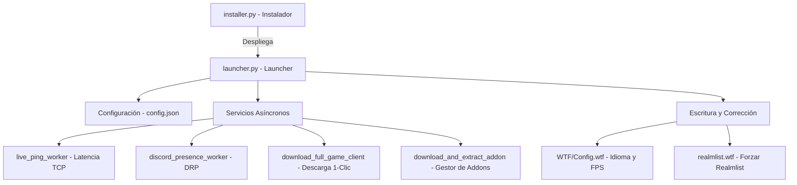

# Manual Técnico y Arquitectura de Software - Capybara Launcher

Este documento detalla la arquitectura de software, los flujos de control de datos y las decisiones de diseño del **Launcher** e **Instalador** del clan **El Séquito del Terror** para **Capycraft.io**. 

Este manual está destinado a desarrolladores que deseen auditar, mantener o ampliar las funcionalidades del sistema.

---

## 🏗️ 1. Arquitectura General y Módulos

El proyecto está diseñado bajo un modelo de **Componentes Gráficos Desacoplados y Servicios de Fondo en Hilos Daemon (Servicios Asíncronos)**, permitiendo que la interfaz permanezca interactiva y fluida mientras ocurren descargas de gigabytes o comprobaciones de red.



---

## ⚡ 2. Sincronización de Hilos y Seguridad en la Interfaz (Thread-Safety en Tkinter)

### El Desafío Técnico
Tkinter (y por extensión CustomTkinter) es un entorno gráfico monohilo. Modificar propiedades de los widgets de la interfaz desde un hilo de ejecución secundario en Python (por ejemplo, el hilo que realiza el bucle de lectura de bytes de `requests`) genera fallos de dibujado críticos, bloqueos visuales o cierres inesperados de la ventana.

### La Solución
Tanto el launcher como el instalador implementan wrappers con `self.after(ms, function, *args)`. Este método coloca la ejecución de la función de modificación visual en la cola principal de eventos de Tkinter, de modo que el hilo de la GUI la procese de forma segura en su propio ciclo.

Ejemplo implementado en `launcher.py`:
```python
def show_status(self, text, color="#E0E0E0"):
    # Encola de forma segura en el bucle principal de la GUI
    self.after(0, lambda: self.status_label.configure(text=text, text_color=color))

def set_progress(self, val):
    self.after(0, lambda: self.progress_bar.set(val))
```

---

## 📦 3. Despliegue e Instalación de Accesos Directos de Windows

El archivo `installer.py` realiza un despliegue completo del cliente de forma modular. Utiliza la librería nativa de Windows `win32com.client` para interactuar con la shell del sistema y crear accesos directos dinámicos enlazados al icono oficial.

### Flujo de Instalación:
1.  **Creación de Directorios:** Crea la estructura de carpetas en la ruta elegida por el usuario (nativamente `C:\Games\WoW Capycraft Sequito`).
2.  **Escritura del Realmlist:** Genera un archivo `realmlist.wtf` de origen para que el cliente esté preconfigurado.
3.  **Extracción de Ejecutable y Configuración:** Copia los archivos embebidos temporales (`Séquito del Terror Launcher.exe`, `config.json`, assets de imágenes e iconos) desde el directorio virtual comprimido temporal de PyInstaller (`sys._MEIPASS`) hacia la ruta física de destino.
4.  **Generación de Accesos Directos:**
    ```python
    import win32com.client
    shell = win32com.client.Dispatch("WScript.Shell")
    
    # Ruta en Escritorio
    desktop_path = shell.SpecialFolders("Desktop")
    shortcut = shell.CreateShortCut(os.path.join(desktop_path, "Séquito del Terror WoW.lnk"))
    shortcut.TargetPath = os.path.join(install_dir, "Séquito del Terror Launcher.exe")
    shortcut.WorkingDirectory = install_dir
    shortcut.IconLocation = os.path.join(install_dir, "assets", "logo.ico")
    shortcut.Save()
    ```

---

## 🔌 4. Lógica del Selector de Idioma (WTF Switcher)

El selector de idioma en `launcher.py` interactúa directamente con el sistema de configuración clásica de World of Warcraft (`WTF/Config.wtf`).

```
[Launcher GUI Dropdown]
      │
      ├──> Español (esES)  ──> Escribe SET locale "esES" en Config.wtf
      ├──> English (enUS)  ──> Escribe SET locale "enUS" en Config.wtf
      └──> 简体中文 (zhCN) ──> Escribe SET locale "zhCN" en Config.wtf
```

### Código de Edición del Config.wtf:
El cargador lee el archivo línea por línea. Si la variable de configuración ya existe, la reemplaza de manera segura; de lo contrario, la añade al final para no corromper otros parámetros de gráficos o sonido del jugador:
```python
def write_wtf_setting(self, setting_name, value):
    wtf_path = os.path.join("WTF", "Config.wtf")
    # ...
    # Busca la cadena `SET setting_name` y la sobrescribe de forma limpia.
    # ...
```

---

## 🚀 5. Motor de Descarga e Integridad del Cliente en 1-Clic

### 1. Detección Inteligente del Ejecutable:
Al iniciar el launcher o el instalador, se evalúa si existe `WoW.exe` en el directorio de ejecución:
```python
if os.path.exists("WoW.exe"):
    # Configura el botón en modo "JUGAR" (Rojo)
else:
    # Configura el botón en modo "DESCARGAR JUEGO" (Naranja)
```

### 2. Algoritmo de Descarga e Información:
La descarga utiliza lectura por bloques (`iter_content`) con medición de velocidad en tiempo real basada en delta de tiempo:
```python
start_time = time.time()
for chunk in r.iter_content(chunk_size=65536):
    dl += len(chunk)
    # ...
    elapsed = time.time() - start_time
    speed = dl / elapsed  # Bytes/segundo
    speed_mb = speed / (1024 * 1024)  # Megabytes/segundo
    eta = (total_size - dl) / speed  # Segundos restantes
```

### 3. Extracción de Carpetas Anidadas:
Dado que los ZIP del juego empaquetados por la comunidad suelen contener los archivos dentro de una carpeta intermedia (ej. `World of Warcraft 1.12.1/WoW.exe`), el motor evalúa si todo el contenido del zip comparte el mismo directorio raíz de primer nivel. Si se detecta esto, tras la extracción el descompresor mueve de forma recursiva todos los archivos un nivel hacia arriba (directorio raíz) y remueve la carpeta contenedora vacía.

---

## 🌐 6. Latencia e Indicadores del Servidor (TCP Ping)

Para ofrecer el estado de latencia real y conectividad con el servidor sin congelar la interfaz, se arranca un hilo daemon `live_ping_worker` al inicio del launcher:
*   Mide el tiempo de conexión TCP de forma asíncrona hacia el host `apac.capycraft.io` (puertos web `80` y de juego `3724`).
*   Calcula el retraso de red en milisegundos.
*   Actualiza de forma fluida el indicador `● ONLINE | Latencia: XX ms` en color verde, o cambia a `● OFFLINE` en color rojo si se agota el tiempo de espera (timeout).
*   Se ejecuta cada 15 segundos en segundo plano de manera continua.
